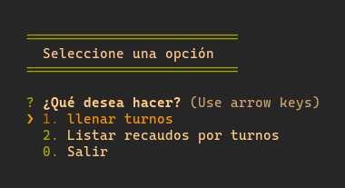
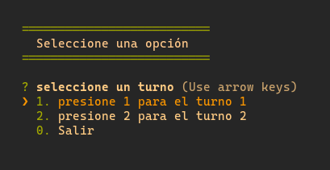
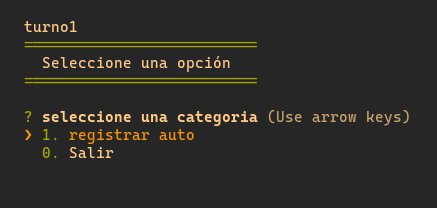
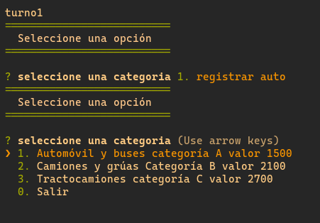
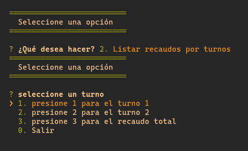
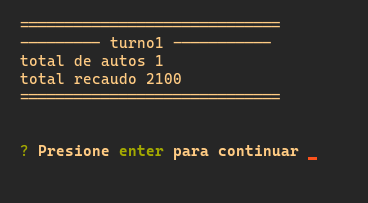

# TEORIA DE GRAFOS ACTVIDAD #1

## Sistema de peaje

### Pre-requirements 📋

To use the project it is necessary to install Nodejs +v18.9.0

## use

> 1. primero le da donde dice `code` o `codigo` y descarga el archivo zip (si sabe usar git, solo haga un git clone).
> 2. segundo extrar el zip y correr `yarn` or `npm install` en la raiz del documento.
> 3. tercero correr `yarn start` or `npm start` en la raiz par ver la ejecucion del codigo

## Built with  🛠️
- [Nodejs]

## Author  ✒️
- **Jose Miguel Ortiz Hernandez**

## Preview

